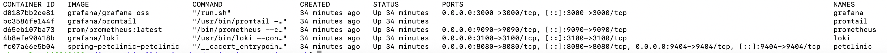
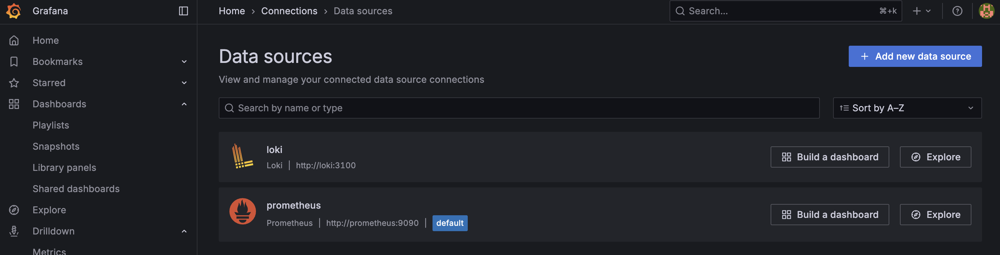
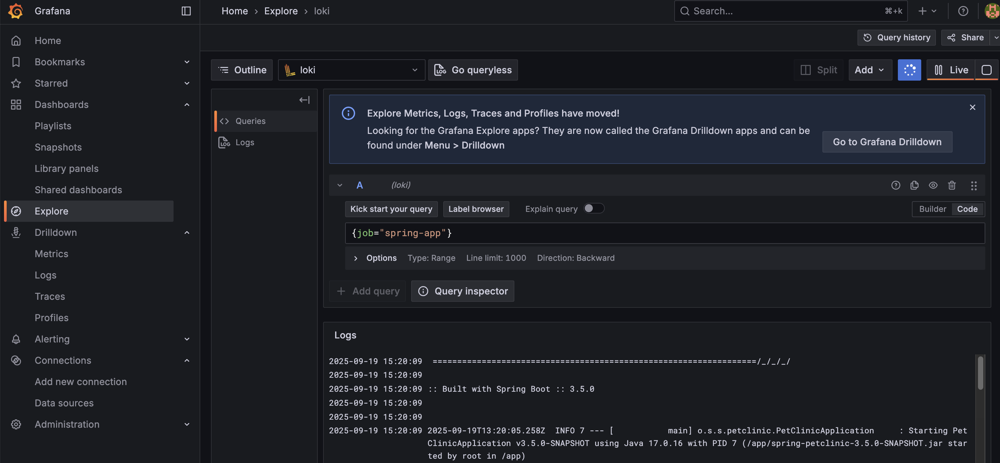
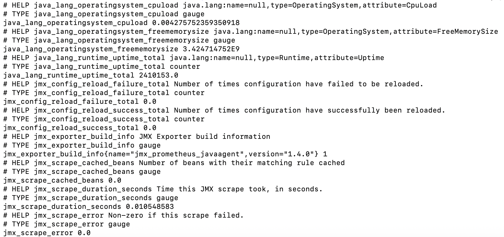

# Monitoring Practical Task

This project demonstrates monitoring a Spring Petclinic app using **Prometheus**, **Grafana**, **Loki**, and **JMX Exporter**.

---

## 1. Dockerfile with JMX Exporter

```dockerfile
FROM eclipse-temurin:17-jre
WORKDIR /app

# Copy application jar
COPY ./target/spring-petclinic-3.5.0-SNAPSHOT.jar .

# Copy JMX Exporter and config
COPY ./jmx/jmx_prometheus_javaagent-1.4.0.jar /opt/jmx/jmx_prometheus_javaagent-1.4.0.jar
COPY ./jmx/config.yml /opt/jmx/config.yml

# Expose application and JMX exporter ports
EXPOSE 8080 9404

# Start application with JMX Exporter
CMD java \
    -javaagent:/opt/jmx/jmx_prometheus_javaagent-1.4.0.jar=9404:/opt/jmx/config.yml \
    -jar spring-petclinic-3.5.0-SNAPSHOT.jar > /var/log/app.log 2>&1
```

* **Port 8080** – Spring Petclinic application
* **Port 9404** – JMX metrics for Prometheus

---

## 2. Additional Configuration Files

* `loki-config.yml` – Loki configuration
* `promtail-config.yml` – Promtail configuration
* `docker-compose.yml` – Automation for running all containers

---

## 3. Results

### Docker Containers



---

### Grafana Data Sources



Prometheus - http://prometheus:9090
Loki - http://loki:3100


---

### Grafana Explore Tab (Logs)



Logs from the Spring Petclinic application are successfully collected via Promtail and displayed in Grafana.

---

### Check Prometheus/JMX Metrics

```bash
curl -s http://localhost:9404/metrics | grep -E "java_lang_|jmx"
```



---

### Prometheus Metrics

Query CPU load from JMX metrics (One example variable "java_lang_operatingsystem_cpuload" ):

```bash
curl 'http://localhost:9090/api/v1/query?query=java_lang_operatingsystem_cpuload'
```

Result:

```json
{
  "status": "success",
  "data": {
    "resultType": "vector",
    "result": [
      {
        "metric": {
          "__name__": "java_lang_operatingsystem_cpuload",
          "instance": "petclinic:9404",
          "job": "spring-petclinic-jmx"
        },
        "value": [1758298904.201, "0.00894773685735264"]
      }
    ]
  }
}
```

This confirms that Prometheus successfully scrapes CPU load metrics from the application.